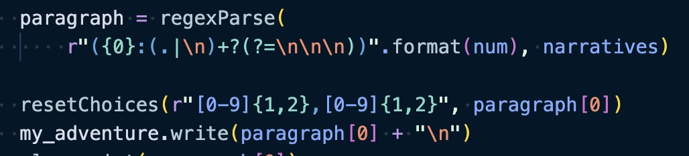
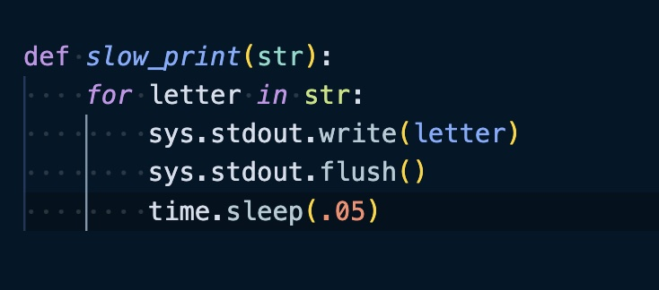

# Adventure
## CS3620 Project

### Description

For our midterm in CS3620 we were given the assignment to create a choose your own adventure text project. That was it, no more instructions. I decided that this would be a great opportunity to scaffold out the story and options with my nephew, who was dying to make a game with me at the time. The result is a story created mostly by him (I helped clean up grammar where necessary) and programmed by me.

### Technologies Used

This project was created entirely in Python 3.

### Challenges 

The main problem I had was figuring out how translate my written stories into a digestable format in the python window. I decided that the main outline of my story had patterns to it, so I decided to use regex in order to grab the parts of the written story that I needed, when I needed them 

The next challenge I encountered was I wanted a way to be able to print the letters slowly rather than all at once, so that you could read it as it happened. I felt this would make it more immersive. With some help from google I was able to find a way to print the text more slowly. I encountered another issue with word wrapping however that I wasn't able to solve.

With these two challenges out of the way I was able to make a text choose your own adventure that I was proud of.
